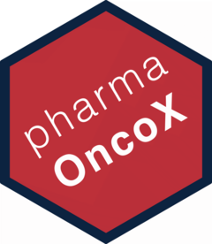

&nbsp;

# pharmOncoX 

**pharmOncoX** is an R package that provides access to targeted and non-targeted cancer drugs, including comprehensive annotations per target, drug mechanism-of-action, approval dates, clinical trial phases for various indications etc. 

## Getting started

* [Installation instructions](https://sigven.github.io/pharmOncoX/articles/pharmOncoX.html#installation)
* [Usage examples](https://sigven.github.io/pharmOncoX/articles/pharmOncoX.html#retrieval-of-drugs---examples)
* [Function reference](https://sigven.github.io/pharmOncoX/reference/)

## Contact

sigven AT ifi.uio.no

## Code of Conduct

Please note that this project is released with a [Contributor Code of Conduct](https://github.com/sigven/pharmOncoX/blob/main/.github/CODE_OF_CONDUCT.md). By participating in this project you agree to abide by its terms.

