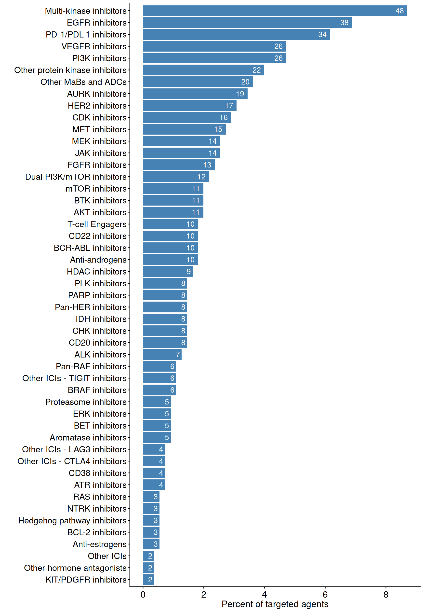
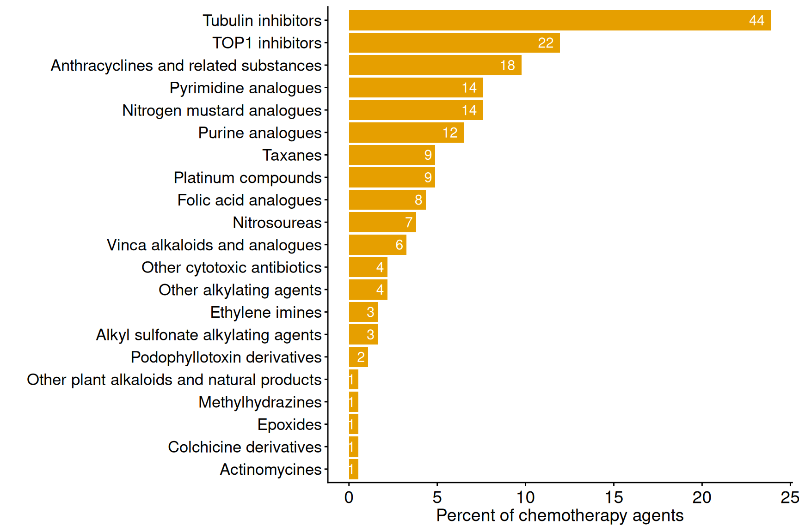

# Getting started

  
  

## Installation

``` r

if (!("remotes" %in% installed.packages())) {
  install.packages("remotes")
}
remotes::install_github('sigven/pharmOncoX')
```

  
  

## Cancer drug classifications

### Targeted agents

Plotted below are key statistics with respect to drug classification
numbers for targeted and chemotherapy agents found in *pharmOncoX*.
Existing drug classifications have been retrieved from
[ATC](https://www.whocc.no/), and these have been extended with manual
addition/curation, and also through the establishment of multiple novel
levels in the ATC tree, particularly for targeted therapies. Note that
only drugs that are indicated for cancer conditions (as harvested from
the Open Targets platform) are considered in the numbers plotted below.

  



### Chemotherapy agents



  
  

## Retrieval of drugs - examples

### Get BRAF-targeted drugs, list records per indication

``` r

drugs <- get_drugs(
  cache_dir = cache_dir,
  treatment_category = c("targeted_therapy_classified",
                         "targeted_therapy_unclassified"),
  drug_target = c('BRAF'))

## Number of drug records
nrow(drugs$records)
#> [1] 278

## Column names of drug records
colnames(drugs$records)
#>  [1] "drug_id"                            "drug_name"                         
#>  [3] "drug_type"                          "molecule_chembl_id"                
#>  [5] "drug_action_type"                   "drug_alias"                        
#>  [7] "nci_concept_definition"             "opentargets"                       
#>  [9] "drug_cancer_relevance"              "inhibition_moa"                    
#> [11] "is_adc"                             "nci_t"                             
#> [13] "target_symbol"                      "target_entrezgene"                 
#> [15] "target_genename"                    "target_ensembl_gene_id"            
#> [17] "target_type"                        "drug_approved_indication"          
#> [19] "disease_efo_id"                     "disease_efo_label"                 
#> [21] "primary_site"                       "drug_max_clinical_stage_indication"
#> [23] "drug_max_clinical_stage"            "drug_n_indications"                
#> [25] "drug_approved_noncancer"            "drug_frac_cancer_indications"      
#> [27] "drug_clinical_id"                   "drug_clinical_source"              
#> [29] "atc_code_level1"                    "atc_level1"                        
#> [31] "atc_code_level2"                    "atc_level2"                        
#> [33] "atc_code_level3"                    "atc_level3"                        
#> [35] "atc_treatment_category"
```

  
  

### Get RAS-targeted drugs, list per drug target

``` r

drugs_ras <- get_drugs(
  cache_dir = cache_dir,
  treatment_category = c("targeted_therapy_classified"),
  drug_action_inhibition = TRUE,
  output_resolution = "drug2target")$records |>
  dplyr::filter(atc_level3 == "RAS inhibitors") |>
  dplyr::select(
    -c("drug_alias", "disease_main_group", "drug_clinical_id")) |>
  dplyr::mutate(
    disease_indication = stringr::str_replace_all(
      disease_indication, "\\|", ", ")) |>
  dplyr::select(
    drug_id, drug_name, drug_type, molecule_chembl_id,
    drug_action_type, target_symbol, dplyr::everything())
```

  

  
  

### Get MEK inhibitors, list per drug only

``` r

drugs_mek <- get_drugs(
  cache_dir = cache_dir,
  treatment_category = c("targeted_therapy_classified"),
  drug_action_inhibition = TRUE,
  drug_source_opentargets = TRUE,
  output_resolution = "drug")$records |>
  dplyr::filter(atc_level3 == "MEK inhibitors") |>
  dplyr::select(
    -c("drug_alias", "disease_main_group", "drug_clinical_id")) |>
  dplyr::mutate(
    disease_indication = stringr::str_replace_all(
      disease_indication, "\\|", ", "))
```

  

  
  

### Get immune checkpoint inhibitors, list per drug target

``` r

drugs_ici <- get_drugs(
  cache_dir = cache_dir,
  treatment_category = c("targeted_therapy_classified"),
  drug_source_opentargets = FALSE,
  drug_classified_cancer = TRUE,
  output_resolution = "drug2target")$records |>
  dplyr::filter(
    !is.na(atc_level3) &
      atc_level3 %in% c("PD-1/PDL-1 inhibitors",
                        "Other ICIs - LAG3 inhibitors",
                        "Other ICIs - TIGIT inhibitors",
                        "Other ICIs - CTLA4 inhibitors",
                        "Other ICIs")) |>
  dplyr::select(
    -c("drug_alias", "disease_main_group", "drug_clinical_id")) |>
  dplyr::mutate(
    disease_indication = stringr::str_replace_all(
      disease_indication, "\\|", ", ")) |>
  dplyr::select(
    drug_id, drug_name, drug_type,
    target_symbol, target_genename,
    dplyr::everything())
```

  

  
  

### Get immune checkpoint inhibitors indicated for lung cancer, list per drug-target entry

``` r

drugs_ici_lung <- get_drugs(
  cache_dir = cache_dir,
  output_resolution = "drug2target",
  treatment_category = c("targeted_therapy_classified"),
  drug_source_opentargets = TRUE,
  drug_indication_main = "Lung")$records |>
  dplyr::filter(
    !is.na(atc_level3) &
      atc_level3 %in% c("PD-1/PDL-1 inhibitors",
                        "Other ICIs - LAG3 inhibitors",
                        "Other ICIs - TIGIT inhibitors",
                        "Other ICIs - CTLA4 inhibitors",
                        "Other ICIs")) |>
  dplyr::select(
    -c("drug_alias", "disease_main_group", "drug_clinical_id")) |>
  dplyr::mutate(
    disease_indication = stringr::str_replace_all(
      disease_indication, "\\|", ", ")) |>
  dplyr::select(
    drug_id, drug_name, drug_type,
    target_symbol, target_genename,
    dplyr::everything())
```

  

  
  

### Get antimetabolite drugs

``` r

drugs_antimetab <- get_drugs(
  cache_dir = cache_dir,
  treatment_category = c("chemo_therapy_classified"),
  output_resolution = "drug")$records |>
  dplyr::filter(
    !is.na(atc_level2) &
      stringr::str_detect(atc_level2, "ANTIMETABOLITES")) |>
  dplyr::select(
    -c("drug_alias", "disease_main_group", "drug_clinical_id")) |>
  dplyr::mutate(
    disease_indication = stringr::str_replace_all(
      disease_indication, "\\|", ", "))
```

  

  
  

### Get taxanes

``` r

drugs_taxanes <- get_drugs(
  cache_dir = cache_dir,
  treatment_category = "chemo_therapy_classified",
  output_resolution = "drug")$records |>
  dplyr::filter(
    stringr::str_detect(atc_level3, "Taxanes")) |>
  dplyr::select(
    -c("drug_alias", "disease_main_group", "drug_clinical_id")) |>
  dplyr::mutate(
    disease_indication = stringr::str_replace_all(
      disease_indication, "\\|", ", "))
```

  

  
  

### Get platinum compounds

``` r

drugs_platins <- get_drugs(
  cache_dir = cache_dir,
  treatment_category = "chemo_therapy_classified",
  output_resolution = "drug")$records |>
  dplyr::filter(
    stringr::str_detect(atc_level3, "Platinum compounds")) |>
  dplyr::select(
    -c("drug_alias", "disease_main_group", "drug_clinical_id")) |>
  dplyr::mutate(
    disease_indication = stringr::str_replace_all(
      disease_indication, "\\|", ", ")) |>
  dplyr::select(
    drug_id, drug_name, drug_type, molecule_chembl_id,
    drug_action_type, opentargets, dplyr::everything())
```

  

  
  

## Retrieval of biomarkers

### Reported associations between BRCA1/2 alterations and drug sensitivity

- Get evidence from [CIViC](https://civicdb.org) and
  [CGI](https://www.cancergenomeinterpreter.org/biomarkers) for cancer
  drug sensitivity of BRCA1/2 alterations (somatically (tumor) or
  inherited/germline)

``` r

biomarkers <- get_biomarkers(cache_dir = cache_dir)

brca1_biomarkers <- list()
for (source in c('civic', 'cgi')) {
  brca1_biomarkers[[source]] <-
    biomarkers$data[[source]]$variant |>
    dplyr::filter(!is.na(symbol) & symbol %in% c("BRCA1", "BRCA2")) |>
    dplyr::group_by(variant_id, variant_name_primary, variant_consequence) |>
    dplyr::summarise(
      variant_alias = paste(variant_alias, collapse = ", "),
      .groups = "drop") |>
    dplyr::inner_join(
      biomarkers$data[[source]]$clinical, by = "variant_id") |>
    dplyr::select(
      variant_id, variant_name_primary, therapeutic_context,
      evidence_type, evidence_level,
      biomarker_source, biomarker_source_datestamp,
      molecular_profile_name, evidence_id, variant_origin,
      primary_site, evidence_id, source_id,
      evidence_url, evidence_description, clinical_significance) |>
    dplyr::distinct() |>
    dplyr::rename(
      literature_id = source_id,
      variant_name  = variant_name_primary) |>
    dplyr::filter(evidence_type == "Predictive") |>
    dplyr::select(
      variant_name, primary_site, therapeutic_context,
      molecular_profile_name, evidence_level,
      dplyr::everything())
}

brca1_biomarkers_all <-
  dplyr::bind_rows(
    brca1_biomarkers[['civic']],
    brca1_biomarkers[['cgi']]) |>
  dplyr::arrange(evidence_level)
```

  

  
  

## Session Info

``` r

sessionInfo()
#> R version 4.6.0 (2026-04-24)
#> Platform: x86_64-pc-linux-gnu
#> Running under: Ubuntu 24.04.4 LTS
#> 
#> Matrix products: default
#> BLAS:   /usr/lib/x86_64-linux-gnu/openblas-pthread/libblas.so.3 
#> LAPACK: /usr/lib/x86_64-linux-gnu/openblas-pthread/libopenblasp-r0.3.26.so;  LAPACK version 3.12.0
#> 
#> locale:
#>  [1] LC_CTYPE=C.UTF-8       LC_NUMERIC=C           LC_TIME=C.UTF-8       
#>  [4] LC_COLLATE=C.UTF-8     LC_MONETARY=C.UTF-8    LC_MESSAGES=C.UTF-8   
#>  [7] LC_PAPER=C.UTF-8       LC_NAME=C              LC_ADDRESS=C          
#> [10] LC_TELEPHONE=C         LC_MEASUREMENT=C.UTF-8 LC_IDENTIFICATION=C   
#> 
#> time zone: UTC
#> tzcode source: system (glibc)
#> 
#> attached base packages:
#> [1] stats     graphics  grDevices utils     datasets  methods   base     
#> 
#> other attached packages:
#> [1] pharmOncoX_2.3.0
#> 
#> loaded via a namespace (and not attached):
#>  [1] gtable_0.3.6       jsonlite_2.0.0     dplyr_1.2.1        compiler_4.6.0    
#>  [5] crayon_1.5.3       tidyselect_1.2.1   stringr_1.6.0      assertthat_0.2.1  
#>  [9] scales_1.4.0       yaml_2.3.12        fastmap_1.2.0      ggplot2_4.0.3     
#> [13] R6_2.6.1           generics_0.1.4     curl_7.1.0         knitr_1.51        
#> [17] htmlwidgets_1.6.4  tibble_3.3.1       reactable_0.4.5    RColorBrewer_1.1-3
#> [21] pillar_1.11.1      rlang_1.2.0        stringi_1.8.7      reactR_0.6.1      
#> [25] lgr_0.5.2          xfun_0.57          S7_0.2.2           fs_2.1.0          
#> [29] otel_0.2.0         cli_3.6.6          withr_3.0.2        magrittr_2.0.5    
#> [33] crosstalk_1.2.2    grid_4.6.0         digest_0.6.39      lifecycle_1.0.5   
#> [37] vctrs_0.7.3        evaluate_1.0.5     gargle_1.6.1       glue_1.8.1        
#> [41] farver_2.1.2       googledrive_2.1.2  rmarkdown_2.31     purrr_1.2.2       
#> [45] httr_1.4.8         tools_4.6.0        pkgconfig_2.0.3    htmltools_0.5.9
```

  
  

## References

Griffith, Malachi, Nicholas C Spies, Kilannin Krysiak, et al. 2017.
“CIViC Is a Community Knowledgebase for Expert Crowdsourcing the
Clinical Interpretation of Variants in Cancer.” *Nat. Genet.* 49 (2):
170–74. <http://dx.doi.org/10.1038/ng.3774>.

Kim, Sunghwan, Jie Chen, Tiejun Cheng, et al. 2021. “PubChem in 2021:
New Data Content and Improved Web Interfaces.” *Nucleic Acids Res.* 49
(D1): D1388–95. <http://dx.doi.org/10.1093/nar/gkaa971>.

Nakken, Sigve. 2023. *phenOncoX: A Phenotype Ontology Map for Cancer*.
<https://github.com/sigven/phenOncoX>.

Ochoa, David, Andrew Hercules, Miguel Carmona, et al. 2021. “Open
Targets Platform: Supporting Systematic Drug-Target Identification and
Prioritisation.” *Nucleic Acids Res.* 49 (D1): D1302–10.
<http://dx.doi.org/10.1093/nar/gkaa1027>.

Sioutos, Nicholas, Sherri de Coronado, Margaret W Haber, Frank W Hartel,
Wen-Ling Shaiu, and Lawrence W Wright. 2007. “NCI Thesaurus: A Semantic
Model Integrating Cancer-Related Clinical and Molecular Information.”
*J. Biomed. Inform.* 40 (1): 30–43.
<http://dx.doi.org/10.1016/j.jbi.2006.02.013>.

Tamborero, David, Carlota Rubio-Perez, Jordi Deu-Pons, et al. 2018.
“Cancer Genome Interpreter Annotates the Biological and Clinical
Relevance of Tumor Alterations.” *Genome Med.* 10 (1): 25.
<http://dx.doi.org/10.1186/s13073-018-0531-8>.
